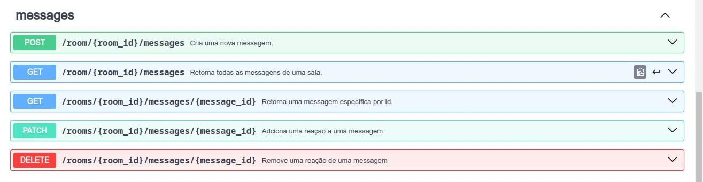

# **AMA API**

 

> **Descrição**  
> Uma API RESTful desenvolvida em Golang para gerenciamento de perguntas e respostas, similar a um sistema AMA (Ask Me Anything). A API permite que usuários façam perguntas e que essas perguntas sejam respondidas pelos administradores.

## **Índice**

1. [Visão Geral do Projeto](#visão-geral-do-projeto)
2. [Estrutura do Projeto](#estrutura-do-projeto)
3. [Instalação](#instalação)
4. [Uso](#uso)
5. [Documentação da API](#documentação-da-api)
6. [Contribuição](#contribuição)
7. [Contato](#contato)

## **Visão Geral do Projeto**

Este projeto visa fornecer uma plataforma onde os usuários podem fazer perguntas e obter respostas. É ideal para cenários onde a interação com a audiência é valorizada, como sessões de perguntas e respostas, fóruns de discussão ou comunidades online.

### **Principais Funcionalidades:**
- Cadastro e autenticação de usuários.
- Criação, leitura, atualização e exclusão (CRUD) de perguntas e respostas.
- Filtragem e pesquisa de perguntas por tags e categorias.
- Moderação de perguntas e respostas.

## **Estrutura do Projeto**

```bash
 .
├── internal
│   ├── api
│   │   ├── utils.go
│   │   └── api.go
│   └── store
│       └── pgstore
│           ├── models.go
│           ├── queries
│           │   └── queries.sql
│           ├── queries.sql.go
│           ├── migrations
│           │   ├── tern.conf
│           │   ├── 002_create_messages_table.sql
│           │   └── 001_create_rooms_table.sql
│           ├── sqlc.yaml
│           └── db.go
├── docs
│   ├── Rooms.postman_collection.json
│   └── ama-api-spec.yaml
├── cmd
│   ├── tools
│   │   └── terndotenv
│   │       └── main.go
│   └── app
│       └── main.go
├── gen.go
├── go.mod
├── go.sum
├── Dockerfile.yml
├── compose.yml
├── .env.example.yml
└── README.md
```
## **Instalação**

### **Pré-requisitos:**

- **Go** (versão 1.23.0 ou superior)
- **Docker** (para configuração em contêiner)
- **PostgreSQL** (ou outro banco de dados suportado)

### **Passos para Instalação:**

1. Clone o repositório:

    ```bash
    git clone https://github.com/mateus-dev-me/ama-api.git
    cd ama-api
    ```

2. Configure as variáveis de ambiente:

    Crie um arquivo `.env` baseado no arquivo `.env.example` e configure suas credenciais e parâmetros do banco de dados.

3. Instale as dependências:

    ```bash
    go mod tidy
    ```

4. Execute as migrações do banco de dados:

    ```bash
    go generate
    ```

## **Uso**

### **Iniciar o Servidor:**

```bash
go run ./cmd/app/main.go
```
A API estará disponível em `http://localhost:8080/api`


## Documentação da API

O arquivo de documentação está em `./internal/api/spec/swagger.json`

 
 
 

## **Contribuição**

1. Faça um fork do projeto.
2. Crie um branch para sua feature (git checkout -b feature/nova-feature).
3. Faça commit das suas mudanças (git commit -m 'Adiciona nova feature').
4. Envie seu branch para o repositório remoto (git push origin feature/nova-feature).
5. Abra um Pull Request.

---

## **Contato**
---

[](mailto:contato@mateus-dev-me.com.br)  
[](https://linkedin.com/in/mateus-dev-me)  
[](https://mateus-dev-me.com.br)


